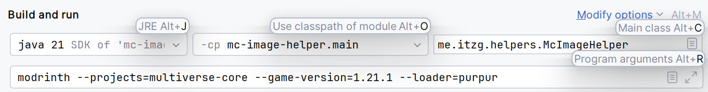

## Ad hoc testing

Beyond the unit tests, ad hoc "integration testing" can be done by running via Gradle passing the intended command-line via `--args`, such as:

```shell
./gradlew run --args="assert fileExists build.gradle"
```

### Using IntelliJ

Create an "Application" run configuration, such as shown here:



### Build and use application script

Build and install the distribution script

```shell
./gradlew installDist
```

Run the script using:

```shell
./build/install/mc-image-helper/bin/mc-image-helper ...args...
```

