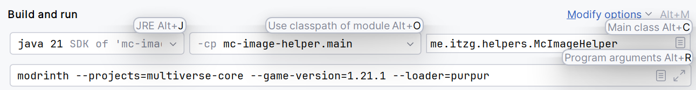

## Ad hoc testing

Beyond the unit tests, ad hoc "integration testing" can be done by running via Gradle passing the intended command-line via `--args`, such as:

```shell
./gradlew run --args="assert fileExists build.gradle"
```

### Using IntelliJ

Create an "Application" run configuration, such as shown here:



### Build and use application script

Build and install the distribution script

```shell
./gradlew installDist
```

Run the script using:

```shell
./build/install/mc-image-helper/bin/mc-image-helper ...args...
```

## Updating command documentation

After adding or changing commands or options, regenerate the README's command overview and subcommand documentation:

```shell
./gradlew run --args="show-all-subcommand-usage update-readme"
```

To check whether the generated documentation is up to date without modifying the file:

```shell
./gradlew run --args="show-all-subcommand-usage check-readme"
```

The same check is available as a Gradle verification task:

```shell
./gradlew checkReadme
```

This task compiles the application as needed and is included in `./gradlew check` and `./gradlew build`. Stale documentation, invalid markers, or file errors fail the task and the build.

Both commands accept an optional README path, defaulting to `./README.md`. They use the HTML START/END comments around each generated section, preserving handwritten content outside those sections. Keep each marker exactly once and in its original order.