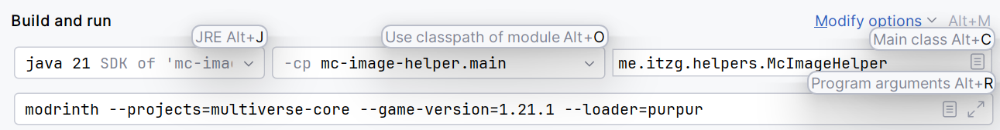

## Ad hoc testing

Beyond the unit tests, ad hoc "integration testing" can be done by running via Gradle passing the intended command-line via `--args`, such as:

```shell
./gradlew run --args="assert fileExists build.gradle"
```

### Using IntelliJ

Create an "Application" run configuration, such as shown here:



### Build and use application script

Build and install the distribution script

```shell
./gradlew installDist
```

Run the script using:

```shell
./build/install/mc-image-helper/bin/mc-image-helper ...args...
```

## Mocking API requests with WireMock

For command tests that call an API, use WireMock instead of making requests to the real service. Commands should allow their default API base URL to be overridden; point that setting at WireMock's per-test URL, then stub the expected request:

```java
@WireMockTest
class SomeCommandTest {
    @Test
    void handlesApiResponse(WireMockRuntimeInfo wm) {
        stubFor(get(urlPathEqualTo("/v1/example"))
            .willReturn(jsonResponse("{\"data\": []}", 200))
        );

        final int status =
                new CommandLine(new SomeCommand())
                        .execute(
                            "--api-base-url",
                            wm.getHttpBaseUrl()
                        );

        assertThat(status).isEqualTo(0);

        verify(getRequestedFor(urlPathEqualTo("/v1/example")));
    }
}
```

Replace `SomeCommand` with the command under test and pass the mocked base URL and any other arguments to the Picocli's `execute`. Be sure to match relevant paths, query parameters, and headers in stubs; however, Wiremock provides helpful output if you miss any. Verify requests when the test needs to assert that the command called the API as expected.

## Updating command documentation

After adding or changing commands or options, regenerate the README's command overview and subcommand documentation:

```shell
./gradlew updateReadme
```

To check whether the generated documentation is up to date without modifying the file:

```shell
./gradlew run --args="show-all-subcommand-usage check-readme"
```

The same check is available as a Gradle verification task:

```shell
./gradlew checkReadme
```

This task compiles the application as needed and is included in `./gradlew check` and `./gradlew build`. Stale documentation, invalid markers, or file errors fail the task and the build.

Both commands accept an optional README path, defaulting to `./README.md`. They use the HTML START/END comments around each generated section, preserving handwritten content outside those sections. Keep each marker exactly once and in its original order.