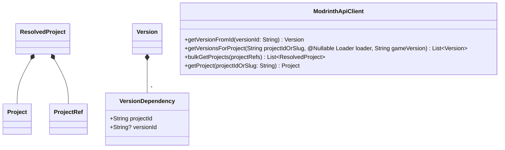
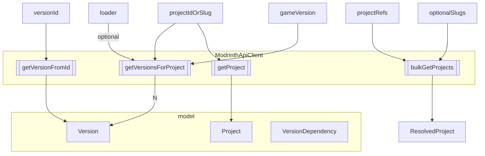

## Dependency resolution

Some rules and behaviors:

- project entry provided by user may reference a file that contains a list of project entries
- projects should be retrieved in bulk where possible, which is more feasible since only ID or slug is needed
- explicit project references given by user take precedence over dependencies
  - can override version type
  - can override loader
- avoid cycles
- a dependency ref that indicates version takes precedence over a ref that does not indicate version
- user may choose to download only required dependencies, optional ones also, or none at all
- user declares global allowed version type (release > beta > alpha)
- user declares global loader, such as paper, forge
- each Loader enum declares compatible loader types and those are hierarchical, such as pufferfish → paper → spigot

### Model and providers

